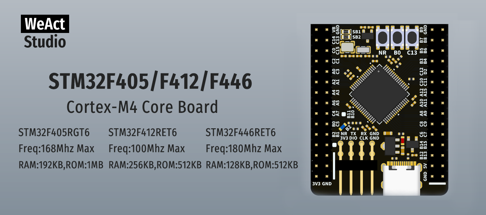
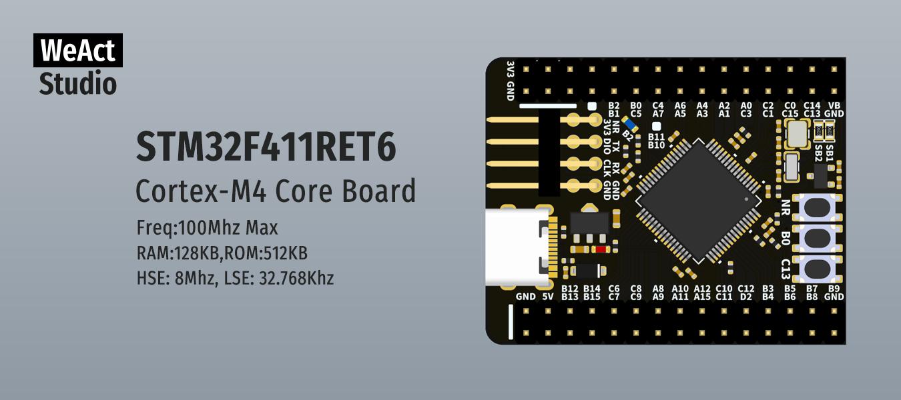

* [中文版本](./README_zh.md)
# WeActStudio.STM32F4_64Pin_CoreBoard
> Note:  
To achieve PCB compatibility across multiple models, the following pin names have different definitions depending on the model variant.

|Pin Name|STM32H562|STM32H503|STM32F405|STM32F412|STM32F446|STM32F411|
| :--:|:--:|:--:|:--:|:--:|:--:|:--:|
|B9 (chip pin62)|NC (VCAP 2.2uF)|NC (VCAP 2.2uF)|PB9|PB9|PB9|PB9|
|B11 (chip pin30)|NC (VCAP 2.2uF)|NC (VCAP 2.2uF)|PB11|PB11|PB11|PB11|



**STM32F405RGT6**  
Freq:168Mhz Max  
RAM:192KB,ROM:1MB  
**STM32F412RET6**  
Freq:100Mhz Max  
RAM:256KB,ROM:512KB  
**STM32F446RET6**  
Freq:180Mhz Max  
RAM:128KB,ROM:512KB  
**STM32F411RET6**  
Freq:100Mhz Max  
RAM:128KB,ROM:512KB   

ST Official Website www.st.com

|Dir Name|Explain|
| :--:|:--:|
|Doc|DataSheet/ReferenceManual|
|Hardware|Hardware Development Kit|
|Examples|Software Examples|

```
/*---------------------------------------
- WeAct Studio Official Link
- taobao: WeActStudio.taobao.com
- aliexpress 1: WeActStudio.aliexpress.com
- aliexpress 2: WeActStudioOne.aliexpress.com
- github: github.com/WeActStudio
- gitee: gitee.com/WeAct-TC
- blog: www.weact-tc.cn
---------------------------------------*/
```