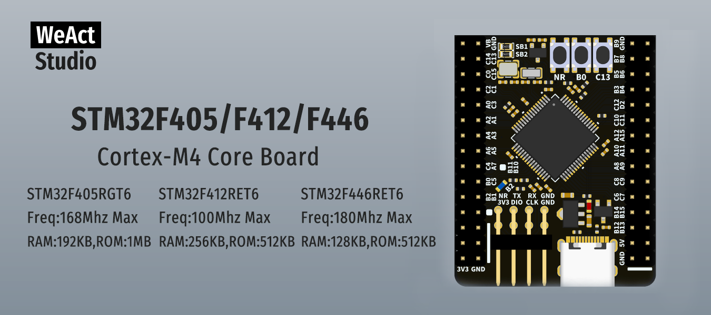

* [English version](./README.md)
# WeActStudio.STM32F4_64Pin_CoreBoard

**STM32F405RGT6**  
Freq:168Mhz Max  
RAM:192KB,ROM:1MB  
**STM32F412RET6**  
Freq:100Mhz Max  
RAM:256KB,ROM:512KB  
**STM32F446RET6**  
Freq:180Mhz Max  
RAM:128KB,ROM:512KB    

ST 官方网站 Website www.st.com

|目录名称|内容|
| :--:|:--:|
|Doc| 数据手册/参考手册|
|Hardware| 硬件开发资料|
|Examples|软件例程|

```
/*---------------------------------------
- WeAct Studio Official Link
- taobao: weactstudio.taobao.com
- aliexpress: weactstudio.aliexpress.com
- github: github.com/WeActStudio
- gitee: gitee.com/WeAct-TC
- blog: www.weact-tc.cn
---------------------------------------*/
```